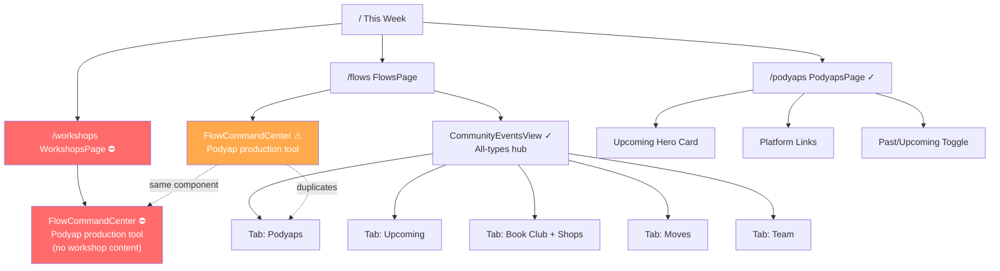
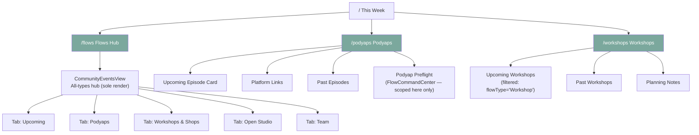

# CR8W Dashboard — Architecture Audit
## Workshops · Flows · Podyaps

*Read-only audit. Evidence gathered from: `routes.ts`, `WorkshopsPage.tsx`, `FlowsPage.tsx`, `PodyapsPage.tsx`, `FlowCommandCenter.tsx`, `CommunityEventsView.tsx`, `api.ts`, and the Notion Backend Hub.*

---

## 1. System Intent vs. Actual Code

### What the system intends (from Notion Backend Hub)
- **`FLOWS`** = one canonical database holding **ALL event types**: Podyaps, Open Studio, Book Club, Workshops, Pop-Ups, Surprise-ments, Geysers, Internal.
- The `Type` field is the differentiator across the seven Well layers plus Internal.
- The dashboard has six canonical views: "This Week at the Well" (all), "Podyap Preflight" (Omar's view), etc.

### What the code actually does
- The routes are flat siblings: `/flows`, `/podyaps`, `/workshops`, each pointing to its own page component.
- **Critical Mismatch:** `WorkshopsPage` actually renders `FlowCommandCenter`, a component explicitly titled and built for the Podyaps crew, showing recording timelines and episode roles instead of workshop-specific content.
- `FlowsPage` stacks the same Podyap-specific `FlowCommandCenter` on top of `CommunityEventsView`, even though `/flows` is meant to be a general hub for all event types.
- `FlowCommandCenter` clearly belongs with Podyaps content only, but is mounted on both `/flows` and `/workshops`, duplicating the Podyaps tab in `CommunityEventsView`.
- `isPodyap()` filtering logic is defined separately in two places with divergent, inconsistent implementations (`flowType` vs `theme`).

---

## 2. Page Hierarchy (Current vs. Recommended)

### Current Page Hierarchy (ASCII)
```text
Dashboard (/)
├── This Week (/)                          ← index route
├── Moves (/moves)
├── Care (/care)
│
├── Flows (/flows)                         ← meant to be parent hub for all 7 FLOWS types
│   ├── [renders] FlowCommandCenter        ← ⚠ Podyap production tool, stacked first
│   └── [renders] CommunityEventsView      ← ✓ correct all-types hub, buried second
│       ├── Tab: Upcoming
│       ├── Tab: Podyaps
│       ├── Tab: Book Club + Shops
│       ├── Tab: Moves
│       └── Tab: Team
│
├── Podyaps (/podyaps)                     ← ✓ self-contained, correct purpose
│   ├── Upcoming hero card
│   ├── Past/upcoming toggle
│   └── Podcast platform links
│       (Spotify / Apple / YouTube / Amazon / Instagram)
│
├── Workshops (/workshops)                 ← ⛔ renders FlowCommandCenter only
│   └── [renders] FlowCommandCenter        ← ⛔ Podyap production tool, no workshop content
│
├── Money (/money)
├── Decisions (/decisions)
└── System (/system)
```

*Missing from route tree entirely:* Open Studio, Book Club, Pop-Up, Surprise-ment, Geyser.

### Recommended Page Hierarchy (ASCII)
```text
Dashboard (/)
├── This Week (/)
├── Moves (/moves)
├── Care (/care)
│
├── Flows (/flows)                         ← hub for all 7 FLOWS types
│   └── [renders] CommunityEventsView only
│       ├── Tab: Upcoming
│       ├── Tab: Podyaps
│       ├── Tab: Workshops & Shops
│       ├── Tab: Open Studio
│       ├── Tab: Team (Pop-Up / Geyser / Internal)
│       └── Tab: All
│
├── Podyaps (/podyaps)                     ← public-facing / listener view
│   ├── Upcoming episode card
│   ├── Past episodes
│   ├── Podcast platform links
│   └── [Podyap Preflight — collapsed/secondary section]
│       (FlowCommandCenter content scoped here, not on /flows or /workshops)
│
├── Workshops (/workshops)                 ← Wellshop / Expresshop / Playshop view
│   ├── Upcoming workshops (filtered from FLOWS by flowType='Workshop')
│   ├── Past workshops
│   └── Workshop planning notes (from agendaItems / sessionNotes)
│
├── Money (/money)
├── Decisions (/decisions)
└── System (/system)
```

---

## 3. Visual Sitemaps (Mermaid)

### Current State


### Recommended State


---

## 4. URL Map Table

| Page | URL | Parent | Nav Location | Priority | Current State |
| :--- | :--- | :--- | :--- | :--- | :--- |
| **This Week** | `/` | — | Sidebar, top | High | ✓ Correct |
| **Flows Hub** | `/flows` | — | Sidebar | High | ⚠ Wrong content stacked above hub |
| **Podyaps** | `/podyaps` | — | Sidebar | High | ✓ Correct purpose, inline style debt |
| **Workshops** | `/workshops` | — | Sidebar | High | ⛔ Wrong component entirely |
| **Open Studio** | *(none)* | `/flows` | CommunityEventsView tab only | Medium | ⚠ No dedicated route |
| **Book Club** | *(none)* | `/flows` | CommunityEventsView tab only | Medium | ⚠ No dedicated route |
| **Pop-Up / Geyser** | *(none)* | `/flows` | CommunityEventsView tab only | Low | ⚠ No dedicated route |

---

## 5. Core Defect Register

* **P1 — CRITICAL: WorkshopsPage renders the Podyap production tool**  
  `src/app/pages/WorkshopsPage.tsx:22` renders `<FlowCommandCenter />`. Zero workshop content is shown.
* **P2 — HIGH: FlowsPage inverts its layer hierarchy**  
  `src/app/pages/FlowsPage.tsx:22-29` mounts `<FlowCommandCenter />` above `<CommunityEventsView />`, burying the event hub under 575 lines of Podyap operations.
* **P3 — HIGH: Triple Podyap representation with no clear source of truth**  
  Podyap content is fragmented across `/podyaps`, `/flows` (tab), and `FlowCommandCenter`.
* **P4 — HIGH: `isPodyap()` defined twice with divergent filter logic**  
  `PodyapsPage.tsx` checks `flowType === 'Podyap'` then theme; `CommunityEventsView.tsx` ignores `flowType` and checks only `['yapcast', 'playdate']`.
* **P5 — MEDIUM: FlowCommandCenter's event-type pills are misread as page filters**  
  Pills in `FlowCommandCenter.tsx` only control the local question bank in the Topic Well, but look like data filters.
* **P6 — LOW: Five FLOWS types have no dedicated route**  
  Open Studio, Book Club, Pop-Up, Surprise-ment, and Geyser exist only as tabs inside `CommunityEventsView`.

---

## 6. Recommended Fix Sequence

1. **Step 1 — Unblock Workshops (Critical):** Remove `<FlowCommandCenter />` from `WorkshopsPage.tsx`. Render workshop-filtered events from `coFlowDates` where `flowType === 'Workshop'`.
2. **Step 2 — Unfork the Flows Hub (High):** Remove `<FlowCommandCenter />` from `FlowsPage.tsx`, allowing `CommunityEventsView` to be the primary hub.
3. **Step 3 — Relocate FlowCommandCenter (High):** Move `FlowCommandCenter` into `PodyapsPage.tsx` as an expandable "Podyap Preflight" section.
4. **Step 4 — Deduplicate Filter Logic (High):** Create `src/lib/flows.ts` with a canonical `matchesFlowType(f: CoFlowDate, type: FlowType)`.
5. **Step 5 — Sidebar Visual Grouping (Low):** Cluster Flows / Podyaps / Workshops under a visual "The Well" header in the navigation.
6. **Step 6 — Contextual Navigation Links (Low):** Add cross-links between the parent `/flows` hub and dedicated sub-pages (`/podyaps`, `/workshops`).
